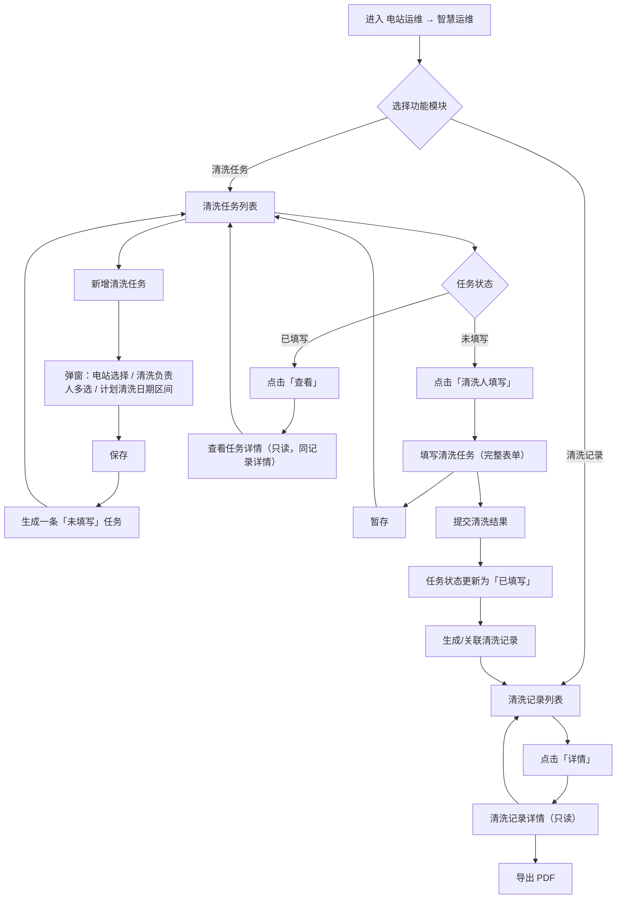
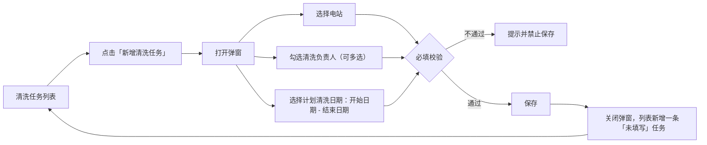
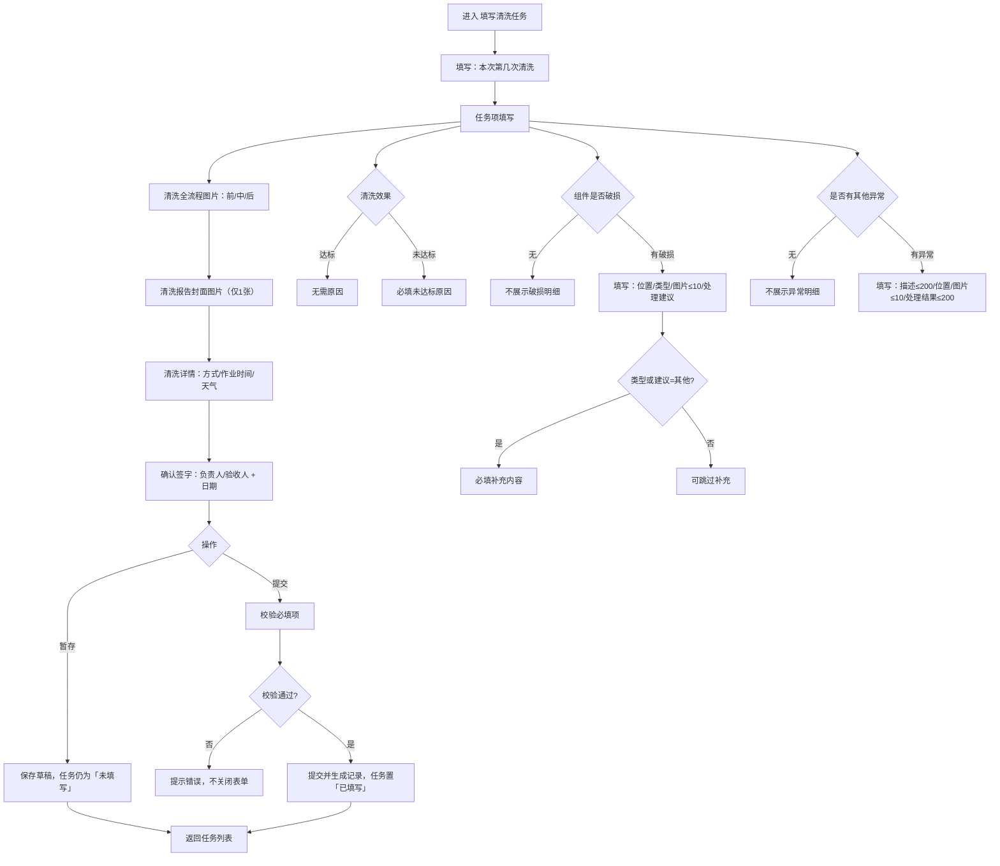
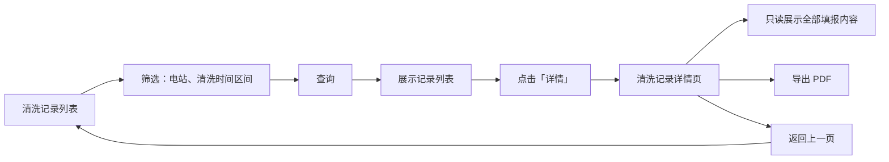

# 智慧运维 — 清洗任务 / 清洗记录 需求规格说明

**文档版本**：2.0  
**编制日期**：2026-03  
**变更说明**：去除「清洗计划」模块，仅保留「清洗任务」「清洗记录」两个功能；清洗任务改为由用户手动新增，形成「创建任务 → 填写执行 → 归档记录」的闭环。

**适用模块**：电站运维 → 智慧运维 → 清洗任务、清洗记录

---

## 1. 概述

### 1.1 模块定位

本说明描述智慧运维下与光伏组件清洗相关的两个功能模块的需求规格，形成「任务创建与执行 → 记录归档与查询」的完整闭环：

| 模块     | 用途简述 |
|----------|----------|
| **清洗任务** | 由运维人员手动新增清洗任务（电站、负责人、计划日期区间），展示待执行/已执行任务列表；支持清洗人在现场「填写清洗任务」录入脏污与效果、组件破损、异常、图片、签字等，支持暂存与提交。 |
| **清洗记录** | 对已提交的清洗任务进行归档，支持按条件查询、查看详情（只读）及导出（如 PDF）。 |

### 1.2 用户角色与入口

- **入口**：顶部选择「电站运维」→ 左侧展开「智慧运维」→ 点击「清洗任务」或「清洗记录」。
- **主要用户**：运维管理员（新增任务、分配负责人、查看记录与导出）、现场清洗人员（填写任务）、管理人员（查看记录与导出）。

### 1.3 术语

| 术语       | 说明 |
|------------|------|
| 清洗任务   | 针对某一电站、在指定日期区间内需执行的一次清洗安排；由用户手动新增，有任务时间范围与填写状态（未填写/已填写）。 |
| 清洗记录   | 已完成并提交的清洗任务所形成的可查询、可导出的历史记录；与「已填写」任务一一对应。 |
| 任务项     | 填写表单中的检查/填写项，如脏污程度、清洗效果、组件破损、其他异常等。 |
| 本次第几次清洗 | 同一任务周期内第几次执行清洗的序号（如 1 表示第 1 次），用于区分同一次任务下的多次清洗填报。 |

### 1.4 业务流程图

#### 1.4.1 主流程（任务 → 填写 → 记录）

#### 1.4.2 新增清洗任务流程

#### 1.4.3 填写清洗任务流程（含校验与条件展示）

#### 1.4.4 清洗记录查询与详情流程

---

## 2. 清洗任务

### 2.1 功能概述

清洗任务用于：  
（1）**手动新增**清洗任务（电站、清洗负责人、计划清洗日期区间）；  
（2）展示**任务列表**（支持按电站、状态、时间筛选，支持批量删除、导出、刷新）；  
（3）对「未填写」任务进行**清洗人填写**（完整表单：任务项、图片、清洗详情、签字），支持暂存与提交；  
（4）对「已填写」任务进行**查看**（只读详情）。  

任务状态：**未填写**、**已填写**。提交后由「未填写」变为「已填写」，并生成或关联一条清洗记录。

### 2.2 清洗任务列表页

#### 2.2.1 页面布局

- **顶部筛选与操作区**（同一行，自适应换行）  
  - 筛选：**电站选择**（文本输入，占位「电站选择」）、**清洗任务状态**（下拉：请选择 / 未填写 / 已填写）、**清洗任务时间**（开始日期～结束日期）、**查询**按钮。  
  - 操作：**新增清洗任务**（主按钮）、**批量删除**、**任务导出**、**刷新**（图标）。  
- **数据表格**：支持多选（表头复选框全选）、排序列、分页。  
- **分页**：展示「共 N 条记录」、每页条数（如 20 条/页）、页码按钮。

#### 2.2.2 列表字段

| 列名           | 说明                     | 备注     |
|----------------|--------------------------|----------|
| 复选框         | 行多选                   | 表头可全选 |
| 序号           | 当前页序号               | 从 1 递增 |
| 电站名称       | 任务所属电站             | —        |
| 责任人         | 任务责任人姓名           | 新增时取「清洗负责人」中之一（如第一个） |
| 联系电话       | 责任人联系电话           | 可空     |
| 清洗任务状态   | 未填写 / 已填写          | 建议用不同颜色标签区分（如未填写红、已填写绿） |
| 任务开始时间   | 任务时间范围开始         | —        |
| 任务结束时间   | 任务时间范围结束         | —        |
| 任务详情       | 操作：**清洗人填写**、**查看** | 未填写显示「清洗人填写」，已填写显示「查看」 |

#### 2.2.3 列表操作

- **新增清洗任务**：打开「新增清洗任务」弹窗，填写电站、清洗负责人（可多选）、计划清洗日期区间，保存后在列表中新增一条状态为「未填写」的任务。  
- **清洗人填写**：进入「填写清洗任务」页面，并关联当前任务 ID；用于现场录入当次清洗数据。仅对「未填写」任务显示或可用。  
- **查看**：进入该任务的只读详情（与「清洗记录详情」结构一致或跳转至记录详情）。仅对「已填写」任务显示或可用。  
- **批量删除**：删除当前勾选的任务；可选二次确认。  
- **任务导出**：按当前筛选条件导出任务列表（如 Excel）。  
- **刷新**：重新拉取列表数据。

#### 2.2.4 业务规则

- 查询：根据「电站选择」「清洗任务状态」「清洗任务时间」等条件过滤列表；缺省可展示全部或默认电站。  
- 分页：每页条数可配置（如 20），页码切换时保留筛选条件。

### 2.3 新增清洗任务（弹窗）

#### 2.3.1 入口与关闭

- **入口**：清洗任务列表页点击「新增清洗任务」。  
- **关闭**：点击弹窗右上角关闭按钮或「取消」按钮，不保存并关闭；点击遮罩可关闭（按产品约定）。

#### 2.3.2 表单字段

| 字段               | 类型       | 必填 | 说明与规则 |
|--------------------|------------|------|------------|
| 电站选择           | 下拉       | 是   | 从已有电站列表选择；选项可来源于当前任务列表中的电站或系统电站主数据。 |
| 清洗负责人（可多选）| 多选勾选   | 是   | 至少选择一人；列表展示可选人员（如鲁杭杰、顾佳兴、周焱等），勾选后作为该任务的清洗负责人；列表中「责任人」可展示为其中一人（如第一个）。 |
| 计划清洗日期（日期区间） | 开始日期、结束日期 | 是 | 两个日期选择器，开始日期 ≤ 结束日期；保存后作为任务的「任务开始时间」「任务结束时间」。 |

#### 2.3.3 底部操作

- **取消**：不保存，关闭弹窗。  
- **保存**：校验必填项（电站、至少一名清洗负责人、开始与结束日期），通过则新增一条任务（状态「未填写」、电站名称、责任人、任务开始/结束时间写入），关闭弹窗并刷新或更新列表；失败则提示错误且不关闭弹窗。

### 2.4 填写清洗任务页（表单）

#### 2.4.1 入口与返回

- **入口**：任务列表某行「未填写」任务点击「清洗人填写」。  
- **返回**：页头「返回上一页」回到任务列表。  
- **页头**：标题「填写清洗任务」、修改时间（如 2026/03/17 23:37:02）、右侧「本次为第 [数字] 次清洗」输入与「返回上一页」按钮。

#### 2.4.2 本次第几次清洗（含总工清洗次数）

- 在页头右侧：**本次为第 [数字输入] 次清洗**。  
- 数字输入：最小值 1，表示本任务周期内第几次执行清洗（如 1 表示第 1 次）。
  - 页面同时展示：**总工清洗 [数字展示] 次**（用于表示本次任务周期内的总清洗次数）。

#### 2.4.3 任务项填写（三组）

表单分为三个任务组，选项与约束如下。

**1、脏污与效果**

| 字段         | 类型   | 选项/规则 |
|--------------|--------|------------|
| 脏污程度     | 下拉   | 请选择、轻微、中等、严重。 |
| 主要污染物   | 下拉   | 请选择、积灰、鸟粪、泥沙、油污、其他；选「其他」时显示补充文本框。 |
| 清洗效果     | 单选   | 达标、未达标；选「未达标」时必填「未达标原因」文本。 |

**2、组件破损记录**

| 字段         | 类型   | 选项/规则 |
|--------------|--------|------------|
| 组件是否破损 | 单选   | 无、有破损。 |
| （当「有破损」时展示） | | |
| 破损位置     | 组合输入 | 第 [串] 串第 [块] 块组件 / [区域组件] 文本。 |
| 破损类型     | 下拉   | 请选择、玻璃裂纹、边框变形、背板破损、其他；选「其他」可填补充。 |
| 破损图片标注 | 图片上传 | 最多 10 张。 |
| 处理建议     | 下拉   | 请选择、无需处理、待更换、临时修复、其他；选「其他」可填补充。 |

**3、其他异常记录**

| 字段         | 类型   | 选项/规则 |
|--------------|--------|------------|
| 是否有其他异常 | 单选 | 无、有异常。 |
| （当「有异常」时展示） | | |
| 异常描述     | 多行文本 | 最多 200 字，显示字数统计。 |
| 异常位置     | 组合输入 | 第 [串] 串第 [块] 块组件 / [区域组件]。 |
| 异常图片标注 | 图片上传 | 最多 10 张。 |
| 处理结果     | 多行文本 | 最多 200 字，显示字数统计。 |

#### 2.4.4 清洗全流程图片

- 三个固定区块，每个区块独立上传：  
  - **清洗前图片（组件原始状态）**：最多 10 张。  
  - **清洗中图片（作业过程）**：最多 10 张。  
  - **清洗后图片（清洁完状态）**：最多 10 张。  
- 每块提供上传入口与数量提示（如「点击上传，最多10张」）。

#### 2.4.5 清洗报告封面图片

- **封面图片**：仅 1 张；独立上传区域，提示「仅限1张」。

#### 2.4.6 清洗详情

| 字段     | 类型   | 选项/规则 |
|----------|--------|------------|
| 清洗方式 | 下拉   | 请选择、人工、高压水枪、机器人。 |
| 作业时间 | 日期   | 年月日选择。 |
| 天气情况 | 下拉   | 请选择、晴、阴、多云。 |

#### 2.4.7 确认签字

| 项目               | 说明 |
|--------------------|------|
| 清洗负责人签字及日期 | 签字区域（手写或上传签名）+ 日期选择；提供「清空」「上传签名」按钮。 |
| 验收人签字及日期   | 同上，独立签字与日期。 |

#### 2.4.8 底部操作

- **暂存**：保存当前填写内容，不提交，任务状态仍为「未填写」，可再次进入继续填。  
- **提交清洗结果**：校验必填项（如本次第几次清洗、必填任务项、至少一张全流程图片等，按产品规则）后提交，任务状态变为「已填写」，并生成或关联清洗记录，关闭表单返回列表。

#### 2.4.9 业务规则

- 提交时可根据需要校验：本次第几次清洗、必填任务项、至少一张全流程图片、签字与日期等（具体以产品规则为准）。  
- 暂存数据与任务 ID 绑定，再次进入「清洗人填写」时回填已暂存内容。  
- 「已填写」任务可点击「查看」进入只读详情，详情结构与「清洗记录详情」一致。

---

## 3. 清洗记录

### 3.1 功能概述

清洗记录用于按条件查询已完成或已提交的清洗记录，并支持查看单条记录的只读详情及导出（如 PDF）。数据来源于「已填写」的清洗任务提交后生成的记录。

### 3.2 清洗记录列表页

#### 3.2.1 页面布局

- **筛选与操作区**  
  - 筛选：**电站选择**（文本输入）、**清洗时间**（开始日期～结束日期）、**查询**。  
  - 操作：**批量删除**、**记录导出**、**刷新**。  
- **数据表格**：多选、分页。  
- **分页**：同清洗任务，如「共 N 条记录」、20 条/页、页码。

#### 3.2.2 列表字段

| 列名     | 说明 |
|----------|------|
| 复选框   | 行多选 |
| 序号     | 当前页序号 |
| 电站名称 | 记录所属电站 |
| 清洗时间 | 该次清洗的日期（可空显示「--」） |
| 责任人   | 责任人姓名 |
| 清洗人员 | 参与清洗的人员，多人在列表中以标签形式展示（如 顾佳兴、周焱） |
| 操作     | **详情**（打开只读详情页） |

#### 3.2.3 列表操作

- **详情**：打开「清洗记录详情」页，展示该条记录的全部填写内容（只读）。  
- **批量删除**：删除勾选记录（逻辑与权限由后端/产品定义）。  
- **记录导出**：按筛选条件导出记录列表。

### 3.3 清洗记录详情页（只读）

#### 3.3.1 入口与返回

- **入口**：记录列表某行点击「详情」。  
- **返回**：右上角「返回上一页」回到记录列表。  
- **页头**：标题「清洗记录详情」；右侧可展示「本次为第 M/N 次清洗」、**导出 PDF**、**返回上一页**。

#### 3.3.2 内容结构（与「填写清洗任务」一致，全部只读）

- **清洗项**（原「任务项填写」）  
  - 1、脏污与效果：脏污程度、主要污染物、清洗效果（及未达标原因）以只读文本/标签展示。  
  - 2、组件破损记录：组件是否破损；若有破损，破损位置、类型、图片、处理建议只读展示。  
  - 3、其他异常记录：是否有其他异常；若有，异常描述、位置、图片、处理结果只读展示。  
- **清洗全流程图片**  
  - 清洗前/清洗中/清洗后三块，仅展示已上传图片，无上传入口。  
- **清洗报告封面图片**  
  - 仅展示已上传的 1 张封面图。  
- **清洗详情**  
  - 清洗方式、作业时间、天气情况，只读文本展示。  
- **确认签字**  
  - 清洗负责人签字及日期、验收人签字及日期，只读展示签字与日期。

#### 3.3.3 导出 PDF

- 点击「导出 PDF」可生成当前详情页的 PDF 文件，供存档或外发。

---

## 4. 数据与状态约定（参考）

### 4.1 清洗任务

- 任务唯一标识：id。  
- 关键属性：电站名称、责任人、联系电话、清洗任务状态（未填写/已填写）、任务开始时间、任务结束时间。  
- 任务来源：用户通过「新增清洗任务」弹窗手动创建，不再依赖清洗计划自动生成。

### 4.2 清洗记录

- 记录唯一标识：id。  
- 关键属性：电站名称、清洗时间、责任人、清洗人员（多人）。  
- 与任务的关系：由「已填写」的清洗任务提交后生成一条记录，任务与记录为一对一关系。

---

## 5. 非功能需求（建议）

- **性能**：列表分页加载，单页条数建议 20～50；详情页图片懒加载。  
- **兼容**：与整体平台一致，支持现代浏览器与常见分辨率。  
- **权限**：列表与导出可按角色控制（如仅管理员可删除、导出）。  
- **审计**：关键操作（如任务删除、任务提交）可记操作日志。

---

**文档结束。** 若与现有《需求规格说明书》有交叉章节，可将本说明作为「智慧运维 — 清洗模块」的独立章节并入总稿，或保持独立文档按模块引用。
